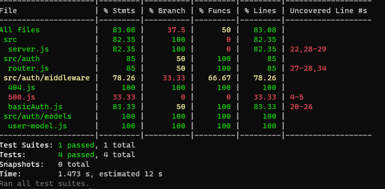
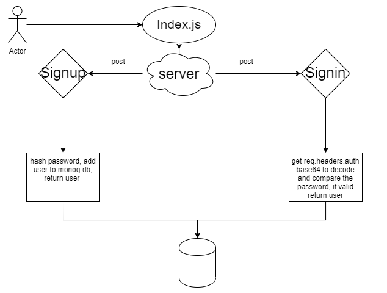

# basic-auth

### Deploy an Express server that implements Basic Authentication, with signup and signin capabilities, using a Mongo database for storage.

### Tests & Deployment :

[Test]()

[Deployment]()

[PullRequest]()

#### Setup

* .env Requirement : PORT = 9000

#### Running The App :
1. Make new repo.
2. clone the repo.
3. npm i all packages.
4. npm start.
5. Endpoints : return Hello from Sukina message.
6. Tests : 
  * npm run test
  * npm run lint

### Test :

### UML :
